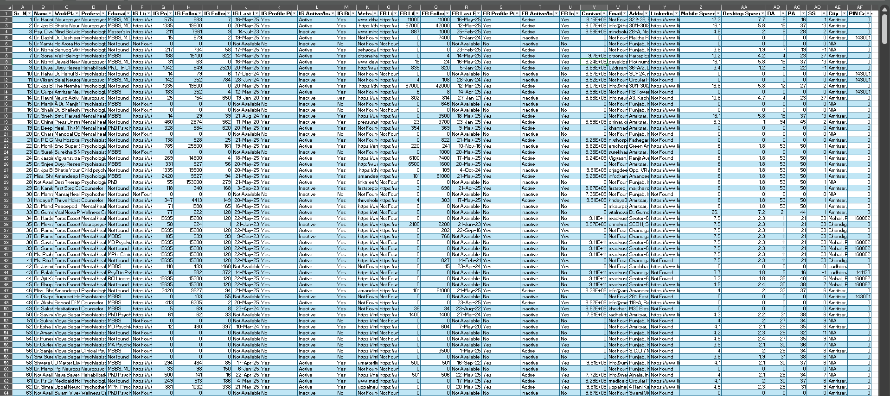
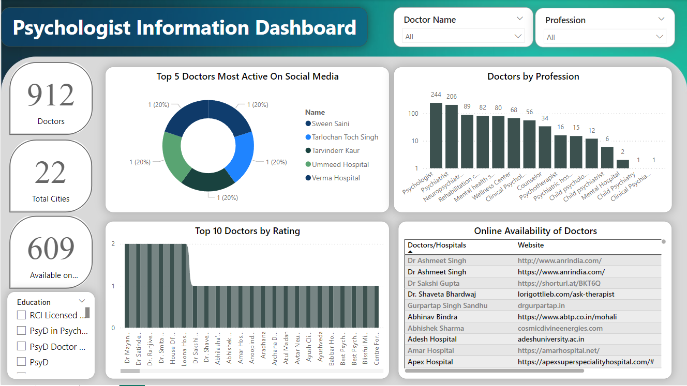
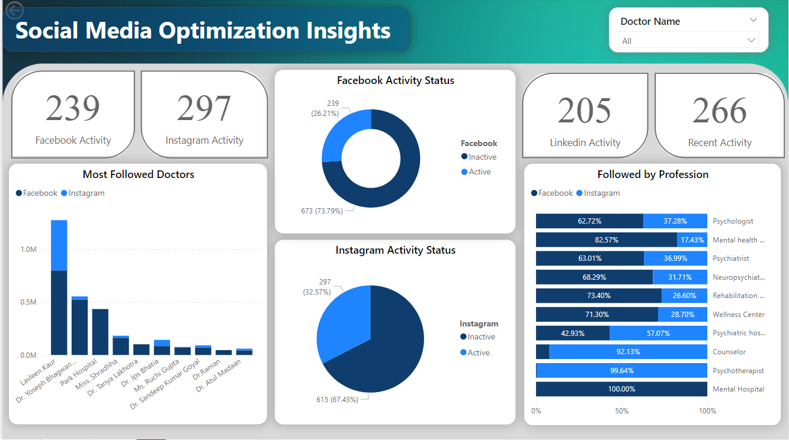
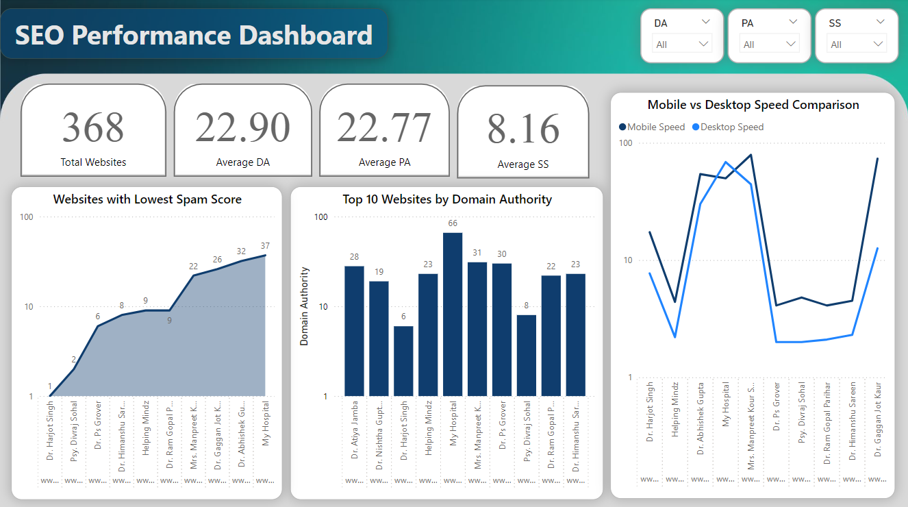

<h1 align="center" style="color:lightgrey; font-size:30px;">
  <b>Project Report</b>  
</h1>
<h2 align="center" style="color:lightgrey; font-size:20px;">
  Study of Psychologist and Mental Health Professionals in Punjab State
</h2>

  Prepared by: Sahil Chaudhari  
(Data Analyst)

___________________________________________________________________________________________________________________________

##### Table of Contents
| Sr. No. | Section                              | Page No. |
|---------|--------------------------------------|----------|
| 1       | Abstract                             | 2        |
| 2       | Introduction                         | 2        |
| 3       | Objectives                           | 2        |
| 4       | Scope of work                        | 2-3      |
| 5       | Data Collection                      | 3        |
| 6       | Social Media & SEO Data Extraction   | 3-4      |
| 7       | Data Cleaning and Preparation        | 4        |
| 8       | Dashboard Development                | 5        |
| 9       | Insights and Analysis                | 6        |
| 10      | Conclusion                           | 6        |
| 11      | References                           | 6        |
| 12      | Appendix                             | 7-8      |

___________________________________________________________________________________________________________________________

### Abstract
This project aimed to automate the end-to-end process of identifying and profiling mental health professionals across Punjab. The workflow included web scraping, social media profiling, SEO performance evaluation, data cleaning using Python (Pandas), and dashboard visualization using Power BI. The final deliverables consist of structured data and three interactive dashboards focused on Personal Information, Social Media Optimization (SMO), and Search Engine Optimization (SEO). This project supports data-driven decisions for outreach, marketing, and partnerships within the mental health sector.

### Introduction
In an era where digital presence influences professional reach and trust, it is critical to understand how healthcare professionals engage online. Especially in mental health—a field driven by visibility, credibility, and outreach—evaluating digital metrics becomes essential.
This project tackles the challenge of identifying and assessing mental health professionals (psychologists, counsellors, rehab centres, etc.) across Punjab by automating data collection and creating meaningful dashboards to highlight their online presence and opportunities for digital growth.

### Objectives
•	To extract valid leads of psychologists and mental health professionals from Google Maps using automation tools.
•	To gather detailed social media metrics (Instagram, Facebook, LinkedIn).
•	To extract SEO performance metrics for each professional's website.
•	To clean and prepare data using the Python library Pandas.
•	To design three user-friendly dashboards for data interpretation.
•	To derive meaningful insights that support digital outreach and decision-making.

### Scope of Work
•	This project covers:
•	Professionals in the field of psychology, counselling, psychiatry, therapy, and mental wellness.
•	Locations across all districts and cities in Punjab, India.
•	Publicly available data from web platforms and SEO tools.
•	Development of three Power BI dashboards: Personal Info, SMO, and SEO.

### Data Collection
•	Tools Used:
•	Playwright (Python): For headless browser automation to navigate and extract listings from Google Maps.
•	BeautifulSoup (bs4): For parsing HTML content and scraping structured details.
•	Custom scripts: To handle pagination, handle loading times, and extract metadata.
•	Extracted Data Columns:
•	Name
•	Workplace / Clinic Name
•	Profession (e.g., Psychologist, Counsellor, Rehab Centre)
•	Address (City, State, PIN)
•	Contact Number
•	Email ID
•	Website URL
•	Output:
•	Raw data records: 1700+
•	Valid, cleaned entries after duplicate removal: - 1000

### Social Media & SEO Data Extraction
•	Social Platforms Tracked:
Profiles located manually or semi-automatically on:
•	Instagram
•	Facebook
•	LinkedIn

•	Extracted fields:
•	Number of followers, following
•	Last post date
•	Profile bio
•	Activity status (Active/Inactive)
•	Website SEO Metrics:
	  Using tools like Moz, Google PageSpeed Insights, and SEO Checkers, extracted:
•	Domain Authority (DA)
•	Page Authority (PA)
•	Spam Score (SS)
•	Page Load Speeds (Mobile & Desktop)
This gives a holistic view of both technical performance and discoverability of their websites.

### Data Cleaning and Preparation
Using Pandas, the raw data was cleaned and formatted through the following steps:
•	Cleaning Steps:
•	Removed special characters, emojis, and invisible Unicode from names and addresses.
•	Trimmed leading/trailing white spaces.
•	Replaced missing values with placeholders where necessary.
•	Standardized city names, professions, and social media statuses.
•	Ensured valid URL formats for websites and social links.
•	Validation:
•	Manual spot-checking of social links and SEO scores.
•	Address formatting adjusted to aid filtering in dashboards.
•	Null values retained in some cases to reflect missing digital presence.

### Dashboard Development
Three dashboards were developed with interactivity, filters, and rich visualizations.
•	Personal Information Dashboard
Purpose: To display professional identity, location, and education info.
Key Visuals:
•	Table with Name, Profession, Contact, Address, Website.
•	Donut Chart: Breakdown by Education (e.g., M.Phil, Ph.D., MA Psychology).
•	Bar Chart: Distribution by City.
•	Filters: Profession, City, Education.
•	SMO Dashboard (Social Media Optimization)
Purpose: To visualize online engagement on Instagram, Facebook, and LinkedIn.
Key Visuals:
•	Cards for Total Profiles Found, Active Profiles, Followers Range.
•	Bar/Column Charts: Top 5 Most Followed Professionals.
•	Line Chart: Posting Trends (based on Last Post Date).
•	Pie Chart: Distribution of Social Media Activity.
•	Filters: Platform, Activity Status, Profession.
•	SEO Dashboard (Search Engine Optimization)
Purpose: To assess website health and ranking factors.
Key Visuals:
•	Table with Website, DA, PA, SS, Speed Scores.
•	Conditional formatting to highlight weak/high SEO performance.
•	KPI Cards: Average DA/PA, Max/Min Speed.
•	Bar Chart: Top Websites by DA.
•	Filters: City, DA Range, Speed Issues.

### Insights and Analysis
•	From Personal Info:
•	Top cities: Ludhiana, Chandigarh, Amritsar, Patiala had the highest number of professionals.
•	Common qualifications: M.A. Clinical Psychology and M.Phil. were most common.
•	Several professionals lacked websites or business emails.
•	From SMO:
•	Over 40% professionals had no active Instagram or Facebook presence.
•	A few professionals had over 10K+ followers, indicating influencer potential.
•	Inactivity was seen in many profiles, especially on Facebook.
•	From SEO:
•	Less than 25% of professionals had websites with DA above 20, suggesting scope for SEO improvement.
•	Several websites had poor mobile speed performance, impacting user experience.
•	Many websites were outdated or lacked HTTPS.

### Conclusion
This project achieved full automation of a complex lead-generation pipeline, covering scraping, cleaning, enrichment (social + SEO), and dashboard creation. The deliverables offer actionable insights into the digital health of mental health professionals in Punjab. The process can be scaled to other regions or industries in the future.

### References
1.	Google Maps (Scraping Source)
2.	Playwright & BeautifulSoup (Python Libraries)
3.	SEO Tools 
4.	Google Page Speed Insights
5.	Instagram, Facebook, LinkedIn
6.	Pandas & Power BI

### Appendix
•	Dataset Screenshots

  

<i>Pic. Dataset 1</i>

•	Dashboard Screenshots

  

<i>Pic. Dashboard 1</i>

  

<i>Pic. Dashboard 2</i>

  

<i>Pic. Dashboard 3</i>

